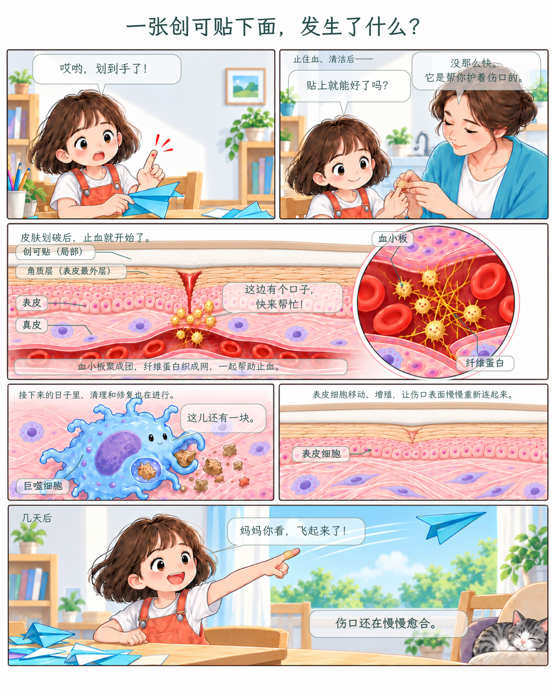
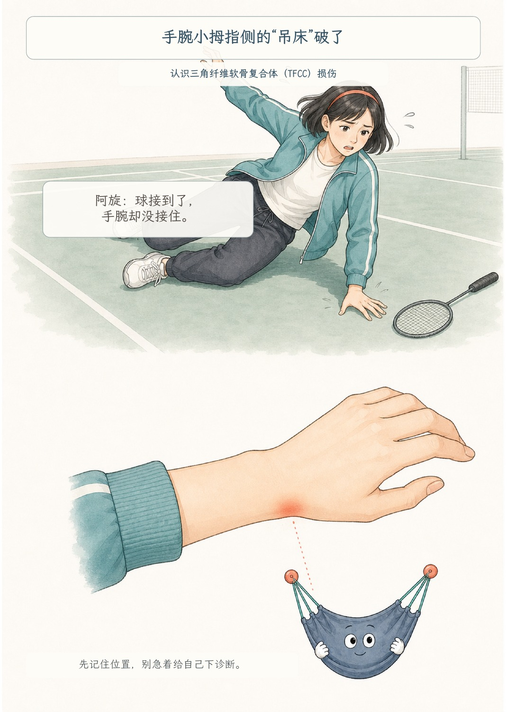
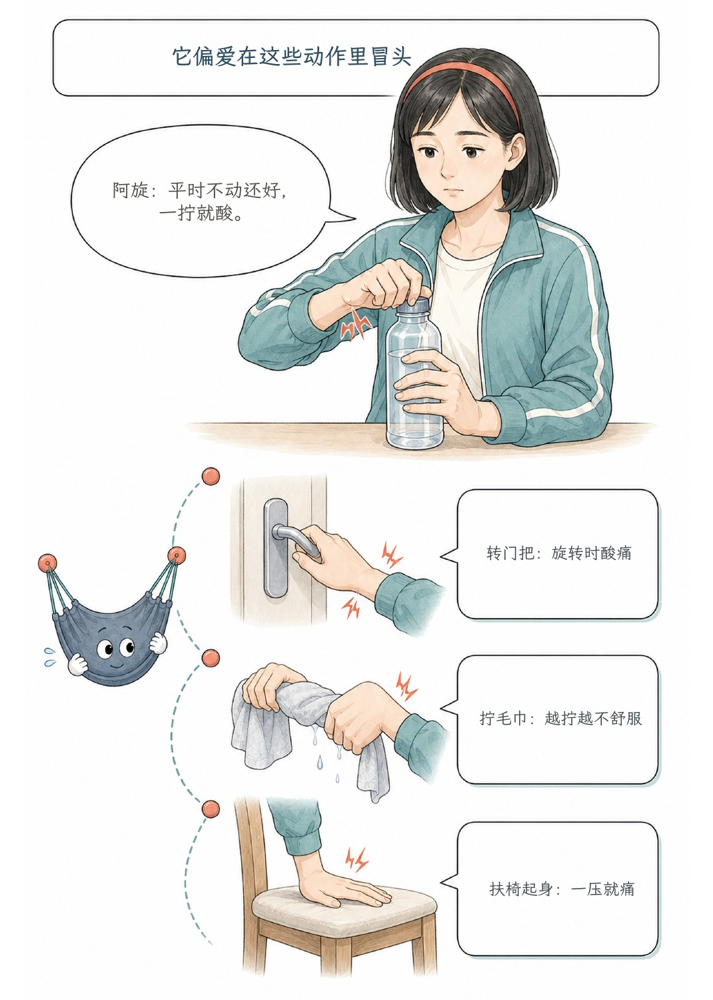
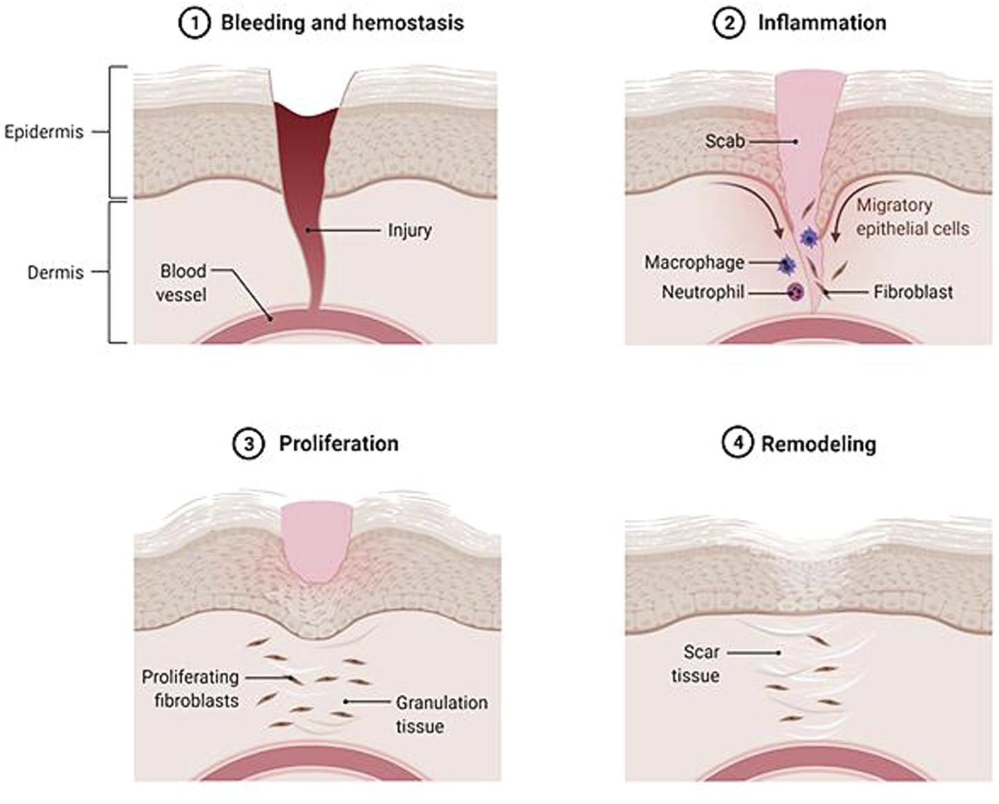
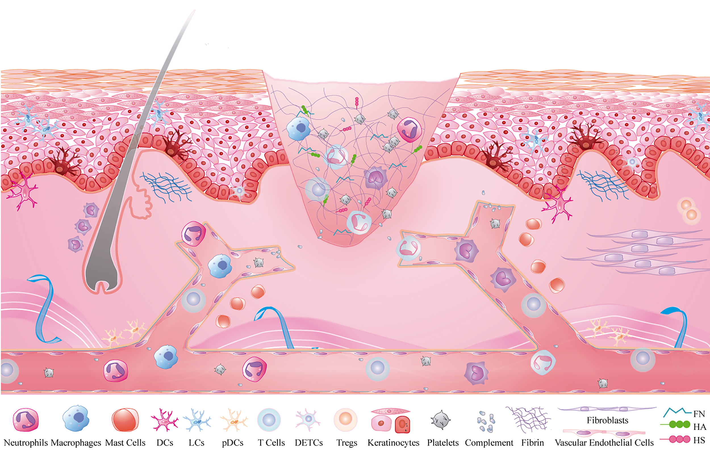
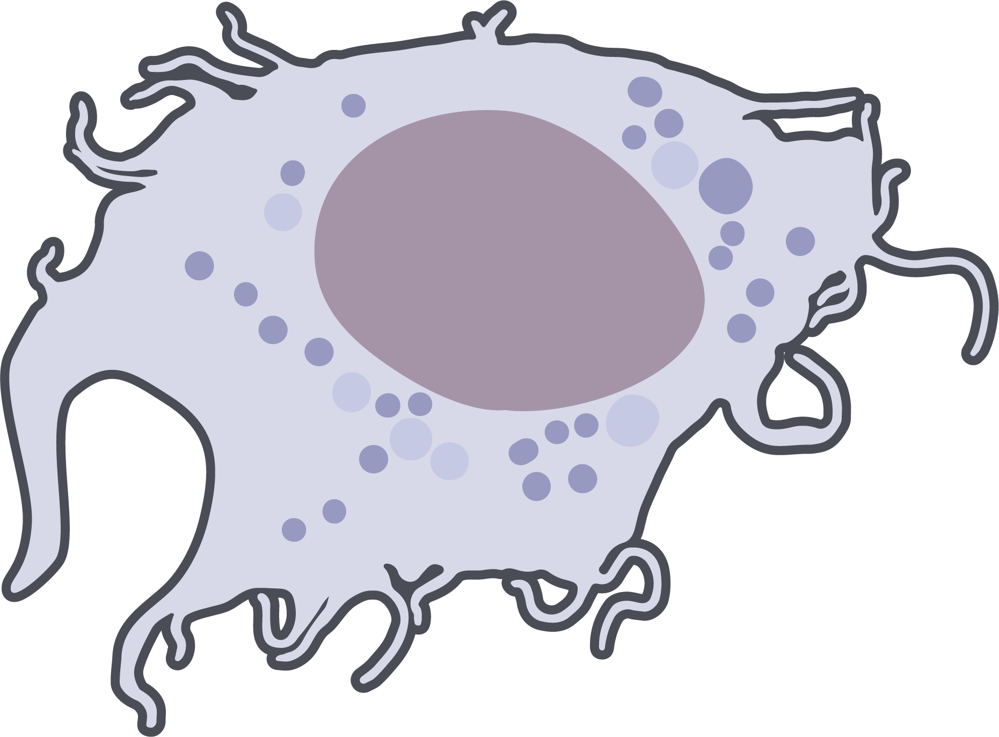

# Medical Illustration

**Turn medical knowledge into readable stories and clear illustrations of anatomy and mechanisms.**

Medical Illustration is a Skill for use in Codex. Describe your topic, audience and intended use. It helps you find medical references, write a script, design and generate artwork, then add editable text and check the result.

[中文](README.md) · [Installation](INSTALL.md#english-installation) · [Releases](https://github.com/wilbert-MD-PhD/medical-illustration/releases)

## What you can make

| Your project | How the Skill helps |
|---|---|
| Educational comics for patients and the public | Explain a medical question through everyday situations, dialogue and connected scenes |
| Medical illustrations for teaching and patient education | Use real references to show anatomical layers, injury locations and repair processes with clear labels |
| Research schematics involving medical structures | Organize structures and mechanisms around your claims and evidence, distinguishing established relationships from hypotheses |

Choose your characters, visual style, length and output format. Text, bubbles, medical labels and added arrows stay editable, making it easier to revise wording, move annotations and correct individual areas. Deliverables can include a Markdown script, color artwork, editable layout files and a PDF.

## See the results

### What happens under an adhesive bandage?

Xiaoman cuts her finger while folding a paper airplane. Once the bandage is on, what happens underneath? The comic starts with a small everyday accident and takes readers through clotting, cleanup and skin repair.

[](docs/showcase/bandage/review-v1.4.pdf)

[Read the PDF](docs/showcase/bandage/review-v1.4.pdf) · [Chinese script](docs/showcase/bandage/script.md) · [How it was made](docs/showcase/bandage/README.en.md)

### A story about wrist pain

The TFCC (triangular fibrocartilage complex) comic brings everyday movement, character dialogue and wrist anatomy into one story. These two pages show another visual style and an example of Chinese lettering.

| Page 1 | Page 2 |
|---|---|
| [](docs/showcase/tfcc/page-1.jpg) | [](docs/showcase/tfcc/page-2.jpg) |

[Read the two-page PDF](docs/showcase/tfcc/review.pdf) · [Example notes](docs/showcase/tfcc/README.md)

## Artwork guided by traceable references

**The Skill guides Codex to find, download and inspect trusted medical references, then attach those images to the drawing request.** This requires available browsing and image tools and permission for the intended use. Suitable references you already have can also be used.

The bandage comic uses references retrieved from **Frontiers and NIH/NIAID BioArt**. These three medical illustrations were checked against their captions and licenses, saved locally and supplied as actual attachments to image generation:

| Wound and epithelial coverage | Epidermal cells and dermis | Macrophage shape |
|---|---|---|
| [](https://doi.org/10.3389/fbioe.2022.865014) | [](https://doi.org/10.3389/fimmu.2022.789274) | [](https://bioart.niaid.nih.gov/bioart/309) |
| Nike et al., 2022, Fig. 1; CC BY 4.0. Skin layers and wound-edge coverage in panels 3 and 5. | Wang et al., 2022, Fig. 1; CC BY 4.0. Keratinocyte shape and the epidermis/dermis relationship. | Ryan Kissinger / NIAID Visual & Medical Arts; Public Domain. Cell body, extensions and nucleus in panel 4. |

Reference use also means checking the specific body part and its structural relationships. For example, the generic skin reference's hair follicle was not copied into the fingertip. Chinese text, bubbles and labels were added separately after generation. Source URLs, download hashes and actual attachment records are available for inspection.

[References and drawing process](docs/showcase/bandage/README.en.md) · [Credits and licenses](docs/showcase/bandage/CREDITS.md)

## Get started

Follow the [installation guide](INSTALL.md#english-installation), then give Codex a request such as:

```text
Use $medical-illustration to create a one-page comic about wound healing for readers without a medical background.
Start with an everyday story, use bright, clear artwork and natural dialogue.
Find and use trusted medical references. Deliver a Markdown script, editable layout files and a PDF.
```

For research figures, provide your claims, papers, structural relationships and target layout. You can also supply an existing script or image for further production, lettering or revision.

This is a production workflow Skill. It needs image-generation tools, available fonts and a vector/PDF editing environment. Supported outputs depend on those tools; Illustrator files require the corresponding software. See the [installation guide](INSTALL.md#english-installation) for setup.

## Checks and review status

The workflow includes comparing structures against references, checking lettering and continuity, and keeping source and revision records. The comics demonstrate production results; human medical sign-off is still pending, as recorded in each example. [Validation scope](docs/validation.md)

## Licenses and feedback

Author: **wilbert**. Content, templates and examples use **CC BY-NC-SA 4.0**; executable code and CI use **MIT**. Third-party reference figures retain their own licenses; see the [showcase credits](docs/showcase/bandage/CREDITS.md). Independently created work does not automatically inherit the Skill's licenses. Copied templates and third-party materials remain subject to their applicable terms.

[License scope](LICENSE.md) · [Third-party notices](plugins/medical-illustration/skills/medical-illustration/NOTICE.md) · [Issues](https://github.com/wilbert-MD-PhD/medical-illustration/issues) · [Maintenance](docs/maintaining.md)
