# Medical Illustration · 医学绘图

**把医学知识画成读得懂的故事，把结构与机制画成看得清的图。**

Medical Illustration 是在 Codex 中使用的医学绘图 Skill。告诉它主题、读者和用途，它会帮助你查找医学参考、编写脚本、设计画面、生成插图，再完成可编辑排字和检查。

[](https://github.com/wilbert-MD-PhD/medical-illustration/actions/workflows/validate.yml)
[](https://github.com/wilbert-MD-PhD/medical-illustration/releases)

[English](README.en.md) · [安装](INSTALL.md) · [版本发布](https://github.com/wilbert-MD-PhD/medical-illustration/releases)

已安装用户可说“检查医学绘图 Skill 更新”“更新医学绘图 Skill”或“回退医学绘图 Skill”。从 1.1.1 起随包提供更新器；旧版首次接入见[安装与更新说明](INSTALL.md)。


## 它能帮你做什么

| 你想制作 | Skill 可以帮助你完成 |
|---|---|
| 面向患者和公众的科普漫画 | 从生活情境出发，用人物对白和连续画面讲清一个医学问题 |
| 教学与宣教用的医学插画 | 依据真实参考表现解剖层次、损伤位置与修复过程，配上清楚的标签 |
| 涉及医学结构的科研示意图 | 根据你提供的研究论断与证据组织结构和机制，区分已证实关系与假说 |

你可以指定角色、画风、篇幅和输出格式。文字、气泡、医学标签及后加箭头独立编辑，后续改词、移动标注和局部返修更方便。交付可包括 Markdown 脚本、彩色画面、排版源文件和 PDF。

## 看看实际产物

<!-- wrist-showcase:start -->
### 八块腕骨，如何在漫画里讲清楚？

医生与阿旋从桌上的八枚圆片聊起，逐步讲清腕骨的两排分组、不同视角，以及骨头之间的关节。这份六页《腕骨与关节组成》示例 v1.1，展示了从生活对白到有据可查的解剖讲解。

| 从故事认识结构 | 转换观察角度 | 找到关节接口 |
|---|---|---|
| [](docs/showcase/wrist/pages/page-1.jpg) | [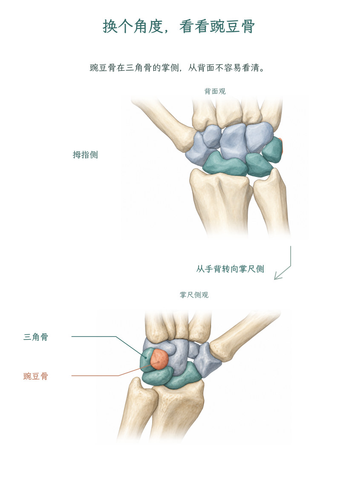](docs/showcase/wrist/pages/page-3.jpg) | [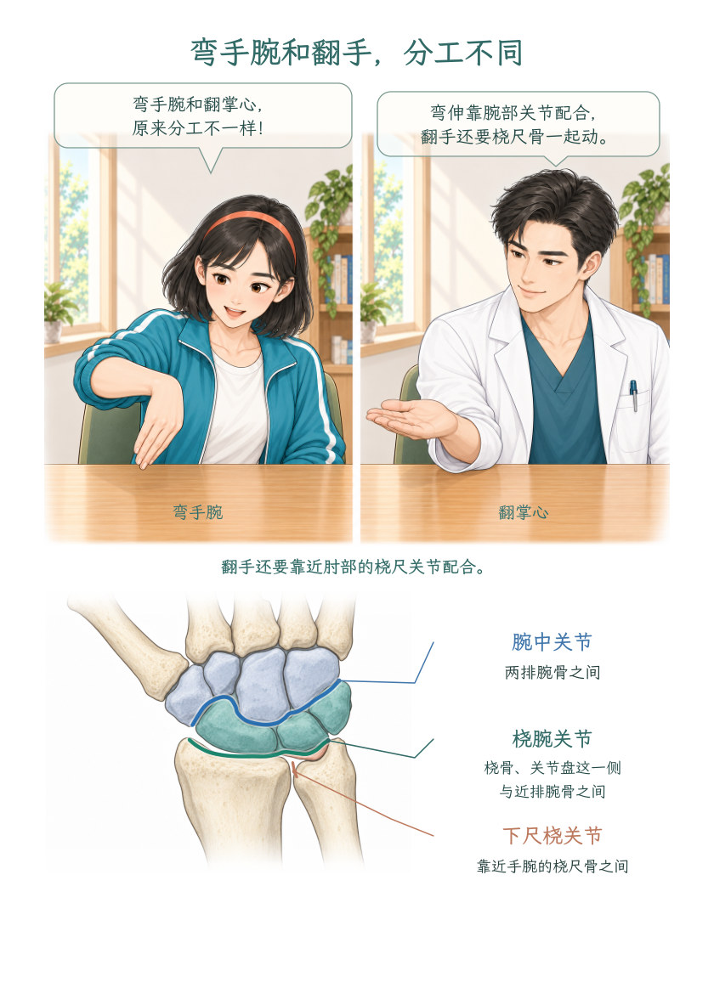](docs/showcase/wrist/pages/page-5.jpg) |

[轻量预览（0.52 MB）](docs/showcase/wrist/preview-light.pdf) · [完整 PDF（30.05 MB）](docs/showcase/wrist/review.pdf) · [逐幅成图与真实参考对照](docs/showcase/wrist/README.md) · [来源与许可](docs/showcase/wrist/CREDITS.md)


<!-- wrist-showcase:end -->

### 一张创可贴下面，发生了什么？

小满折纸飞机时划伤了手指。创可贴贴好了，伤口里面又发生了什么？这篇漫画从一个生活小意外出发，带读者看到止血、清理和表皮修复。

[](docs/showcase/bandage/review-v1.4.pdf)

[阅读 PDF](docs/showcase/bandage/review-v1.4.pdf) · [查看脚本](docs/showcase/bandage/script.md) · [制作过程](docs/showcase/bandage/README.md)

### 手腕疼痛的故事

TFCC（腕关节三角纤维软骨复合体）漫画把日常动作、人物对话和手腕结构放在同一个故事里。下面两页展示了另一种画风与中文排字效果。

| 第一页 | 第二页 |
|---|---|
| [](docs/showcase/tfcc/page-1.jpg) | [](docs/showcase/tfcc/page-2.jpg) |

[阅读两页 PDF](docs/showcase/tfcc/review.pdf) · [示例说明](docs/showcase/tfcc/README.md)

## 每幅解剖图，都能追溯到具体参考

**本 Skill 要求：作品中每项用于医学讲解的解剖结构，都有与部位、视角和层次相匹配的可信依据。** 制作时先核验图谱、教材、原始研究或可追溯模型，实际查看参考，再记录它支持的具体结构、是否附入生成，以及成图对照结果。已有合格参考与母版可以带完整来源链复用。

上面的医生漫画包含 **5 幅解剖底图、6 处放置**。以下按成图逐幅展开参考：既能看到骨骼分区、掌背侧形态与关节盘，也能查到具体图号、书页和实际输入文件。

| 成图位置 | 图谱与教材实际附件 | 核对内容与其他输入 |
|---|---|---|
| 第1页 B01：全手掌面 | Gray219；《Wrist and Hand》Fig.4.18，书页52 | 指骨、掌骨、腕骨的分区与邻接；BodyParts3D M01 提供右手几何。教材只补充腕部关系 |
| 第2页 B02：两排腕骨 | Gray219；Fig.4.18，书页52 | 近排、远排及掌侧遮挡；BodyParts3D M02 提供掌面投影 |
| 第3页上 B03：腕骨背面 | Gray220；Fig.4.18，书页52 | 背侧可见形态与遮挡；BodyParts3D M03 提供背面投影 |
| 第3页下 B04：三角骨与豌豆骨 | Fig.4.18；Fig.4.19a，书页53 | 掌尺侧前后关系；BodyParts3D M04 提供对应视角。两张教材图属于同一来源 |
| 第4–5页 B05：关节接口 | Gray336；Fig.4.19a，书页53 | 桡骨、近排腕骨与尺侧关节盘；M06 为解释性冠状线稿，B02 仅作配色参考 |

### 全手骨骼：指骨、掌骨与腕骨如何衔接

[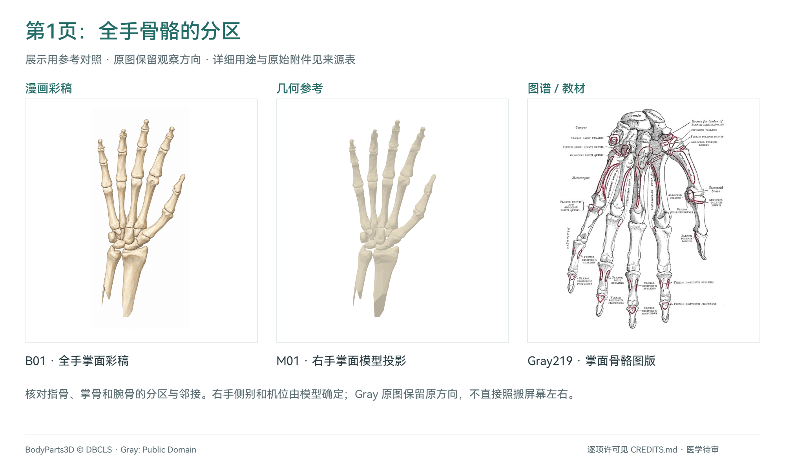](docs/showcase/wrist/comparisons/hand.png)

Gray219 的原图可同时查看指骨、掌骨与腕骨分区。模型给出本例采用的右手机位；图谱保留原有方向。教材 Fig.4.18 的采用范围限于腕部，不用一幅腕部图证明全手所有细节。

### 两排腕骨：分组、邻接与掌侧遮挡

[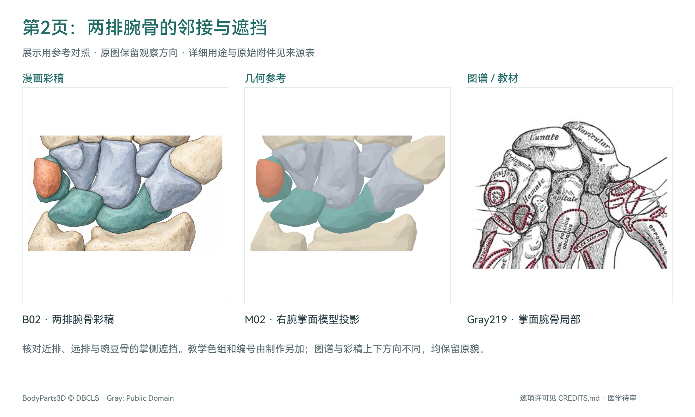](docs/showcase/wrist/comparisons/rows.png)

本组对照着重看腕骨之间的邻接和豌豆骨的掌侧遮挡。颜色与教学编号由制作另加，原图中的英文骨名仍可沿来源图查阅。

### 腕骨背面：换一个角度核对可见结构

[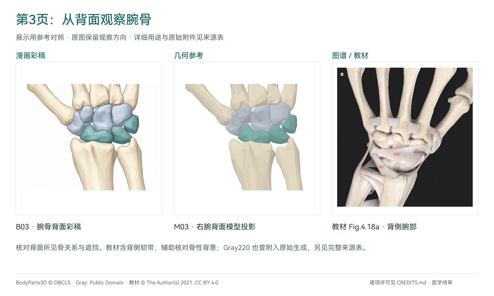](docs/showcase/wrist/comparisons/dorsal.png)

教材 Fig.4.18a 展示背侧腕部，含韧带及其骨性背景；Gray220 也曾作为实际附件参与原图生成。两者用于核对可见形态与遮挡，模型投影确定本例的观察方向。

### 三角骨与豌豆骨：核对掌尺侧的前后关系

[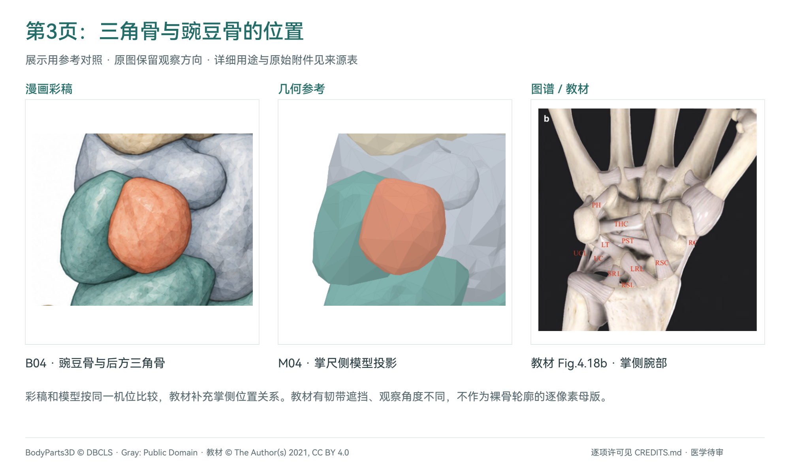](docs/showcase/wrist/comparisons/pisiform.png)

教材 Fig.4.18b 补充掌侧关系，Fig.4.19a 补充尺侧软组织背景。教材图含韧带遮挡且机位不同；彩稿和同机位模型可直接对照，教材按结构关系核对。

### 关节面与关节盘：核对骨与软组织的空间关系

[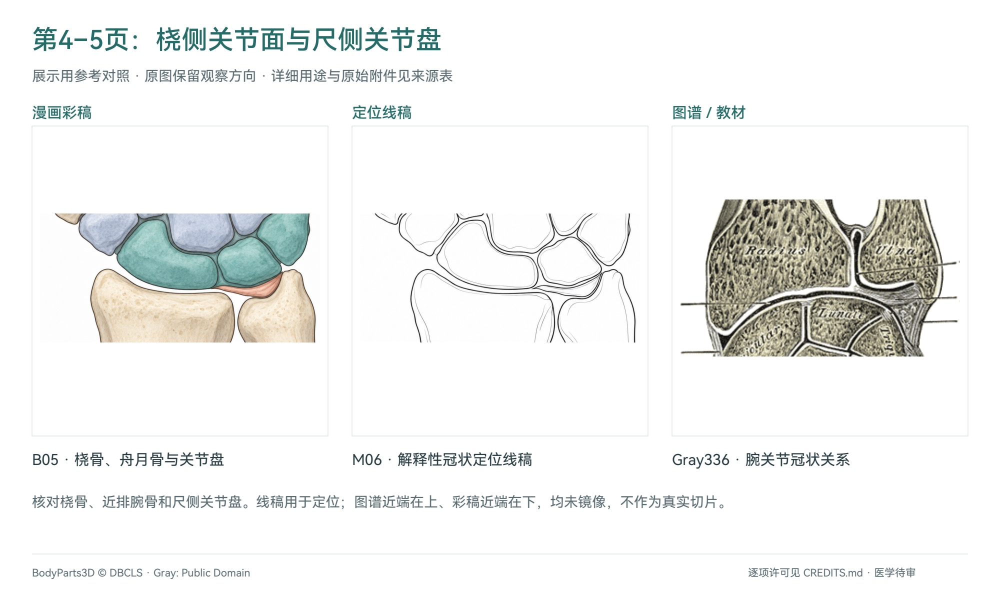](docs/showcase/wrist/comparisons/interfaces.png)

Gray336 展示腕关节冠状关系；教材 Fig.4.19a 的关节盘标为 **AD（articular disk）**。这些参考用于核对桡骨、近排腕骨和尺侧关节盘的相对位置。M06 是教学定位线稿，后加的关节引线另行核对。

### 查看参考原图、教材页与图注

| Gray219 · 掌面骨骼 | Gray220 · 背面骨骼 | Gray336 · 冠状关节关系 |
|---|---|---|
| [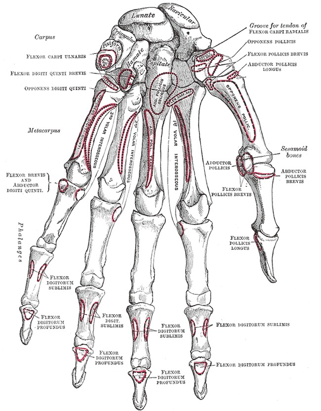](docs/showcase/wrist/references/gray219.jpg) | [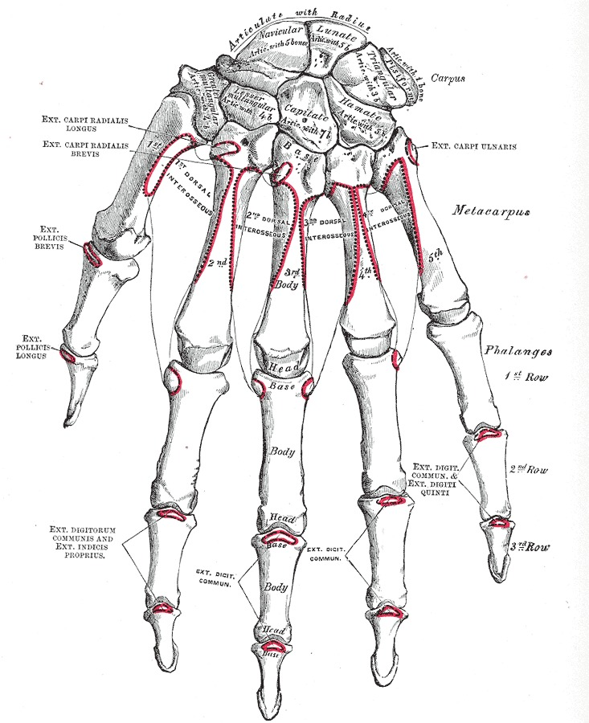](docs/showcase/wrist/references/gray220.jpg) | [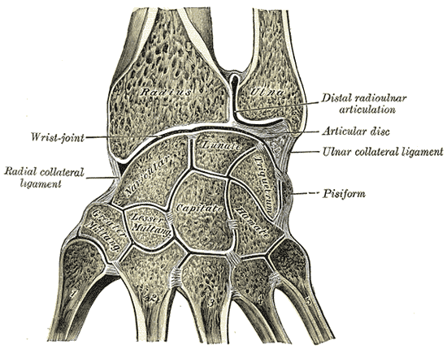](docs/showcase/wrist/references/gray336.png) |
| [原图与出处](https://commons.wikimedia.org/wiki/File:Gray219.png) | [原图与出处](https://commons.wikimedia.org/wiki/File:Gray220.png) | [原图与出处](https://commons.wikimedia.org/wiki/File:Gray336.png) |

| 教材书页52 · Fig.4.18 | 教材书页53 · Fig.4.19a |
|---|---|
| [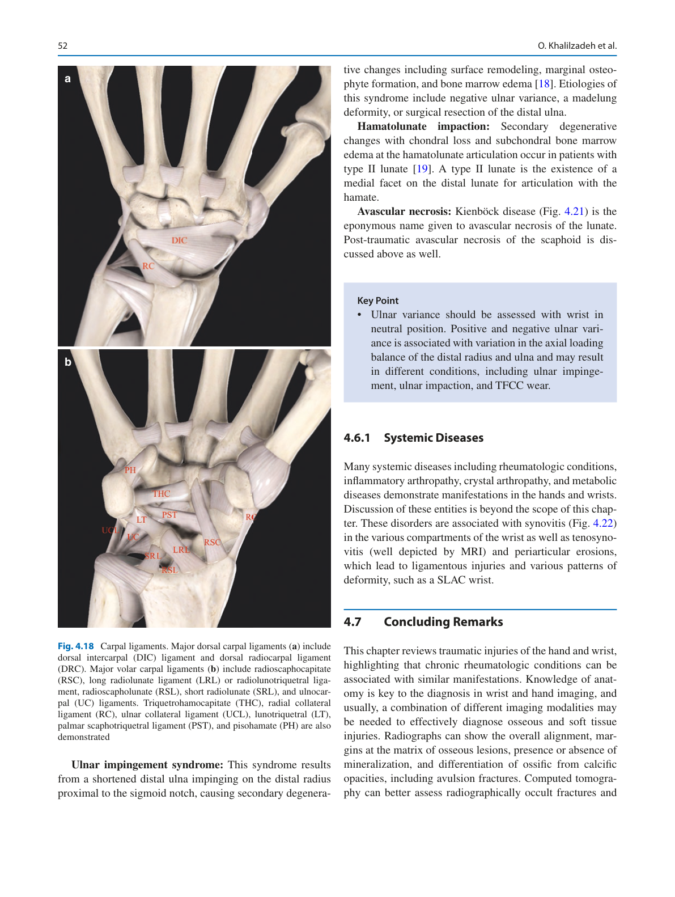](docs/showcase/wrist/references/springer-p52.png) | [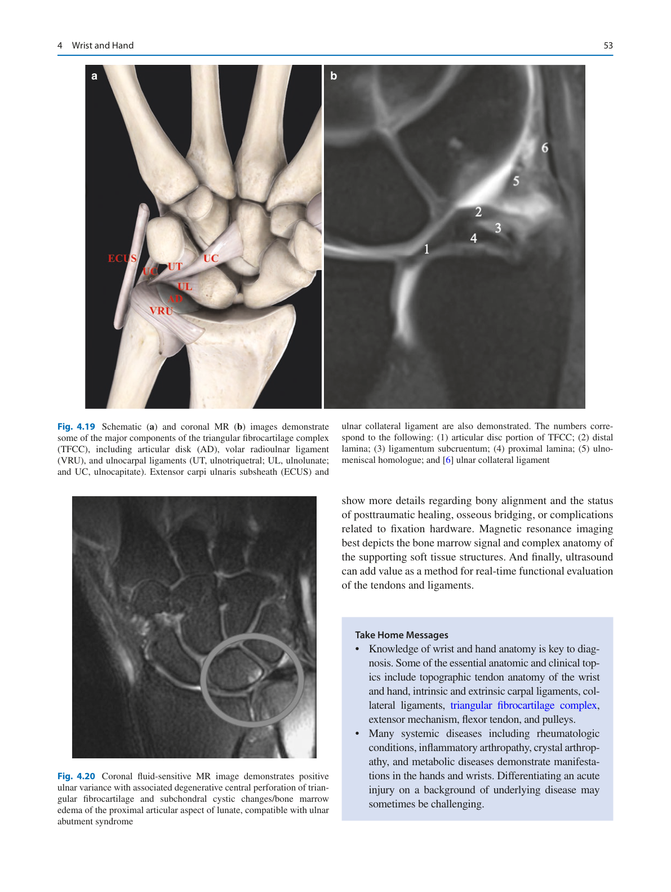](docs/showcase/wrist/references/springer-p53.png) |
| a：背侧；b：掌侧。骨性背景辅助核对不同视角。[原图注](https://www.ncbi.nlm.nih.gov/books/NBK570159/figure/ch4.Fig18/) | a：尺侧软组织示意，含关节盘 AD；同页 MRI 不作为本例的骨形母版。[原图注](https://www.ncbi.nlm.nih.gov/books/NBK570159/figure/ch4.Fig19/) |

Gray 图版出自 Henry Gray 的 *Anatomy of the Human Body*（1918）。教材为 Omid Khalilzadeh、Clarissa Canella、Laura M. Fayad 编写的 *Wrist and Hand*，收录于 Springer 的 *Musculoskeletal Diseases 2021–2024: Diagnostic Imaging*（2021），DOI [10.1007/978-3-030-71281-5_4](https://doi.org/10.1007/978-3-030-71281-5_4)。[NCBI 开放章节](https://www.ncbi.nlm.nih.gov/books/NBK570159/)保留正文与图注。几何来源为 [BodyParts3D / DBCLS](https://dbarchive.biosciencedbc.jp/en/bodyparts3d/lic.html)，本例使用 v4.0 简化99模型的右手和远端前臂部件。

**这些参考有明确的使用记录。** 图谱和完整教材页曾附入原解剖彩稿的生成；医生改编版沿用原底图及来源链。本页五组对照是展示用排版，裁切坐标与哈希见[裁切记录](docs/showcase/wrist/comparisons/crop-map.json)，原附件和提示词见[输入清单](docs/showcase/wrist/reference-map.json)。图谱、教材与模型按各自支持范围使用；同源多图不重复算作独立证据。第5页的[真人动作参考](docs/showcase/wrist/README.md#第5页新增动作的真实参考)与骨骼图谱分别登记，第6页圆片是教学道具。

[五页参考对照 PDF（18.18 MB）](docs/showcase/wrist/comparisons/reference-details.pdf) · [逐幅对应与检查范围](docs/showcase/wrist/README.md) · [来源与逐项许可](docs/showcase/wrist/CREDITS.md)。本示例为**制作完成，医学待审**；来源可追溯与人工医学审签分别记录。

## 开始使用

按[安装说明](INSTALL.md)安装后，可以把这样的请求发给 Codex：

```text
使用 $medical-illustration，为没有医学背景的读者制作一页关于伤口愈合的科普漫画。
从一个生活小故事开始，画面明亮清晰，对白自然。
请查找并使用可信医学参考，交付 Markdown 脚本、可编辑排版文件和 PDF。
```

科研图可以附上研究论断、文献、结构关系和目标版式；已有脚本或图片也可以直接交给它继续制作、排字或返修。

这是制作流程 Skill，需要配合图像生成工具、可用字体及矢量/PDF 编辑环境。具体输出取决于环境能力；使用 Illustrator 格式时需要相应软件。环境配置见[安装说明](INSTALL.md)。

## 检查与使用范围

制作过程中会对照参考检查结构，检查文字排版和跨页一致性，并保存来源及修改记录。这里的漫画可供查看制作效果；医学审签状态见各示例说明，人工医学审签仍待完成。[实际验证范围](docs/validation.md)

## 许可与反馈

作者 **wilbert**。内容、模板与示例采用 **CC BY-NC-SA 4.0**，可执行代码和 CI 采用 **MIT**。第三方参考图沿用各自原许可，见[腕骨示例署名](docs/showcase/wrist/CREDITS.md)及各示例的来源页。独立创作的新作品不因使用 Skill 自动继承许可；复制使用的模板和第三方材料按各自条款处理。

[许可范围](LICENSE.md) · [第三方材料说明](plugins/medical-illustration/skills/medical-illustration/NOTICE.md) · [问题反馈](https://github.com/wilbert-MD-PhD/medical-illustration/issues) · [维护与发布](docs/maintaining.md)
