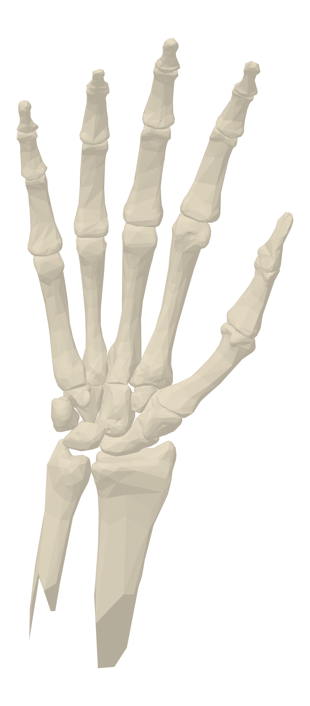
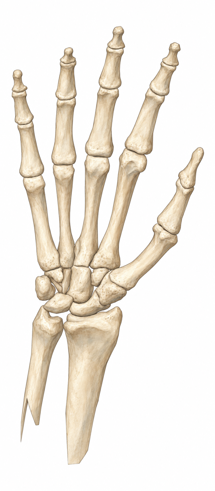
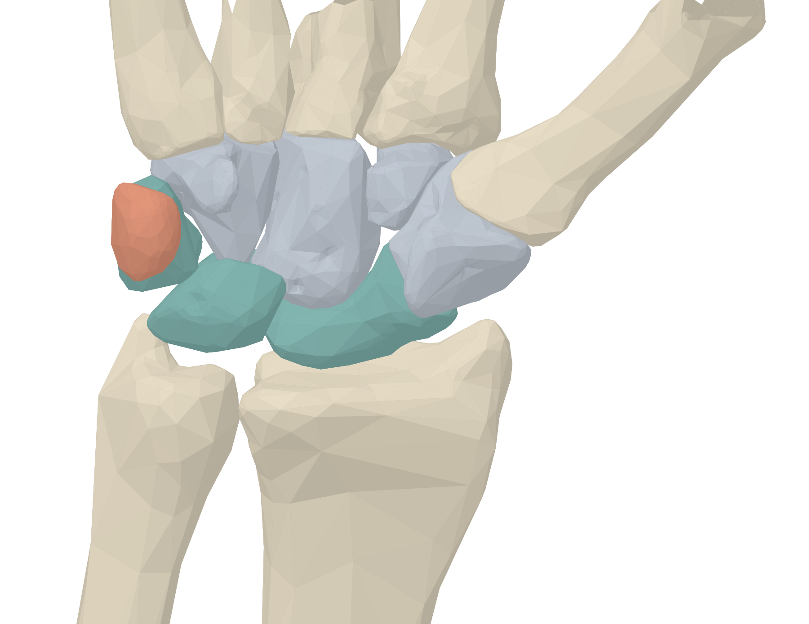
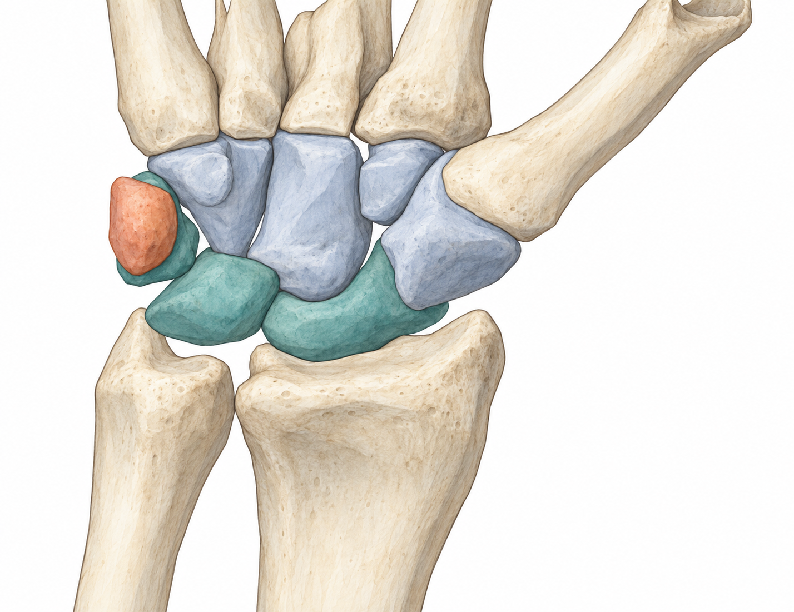
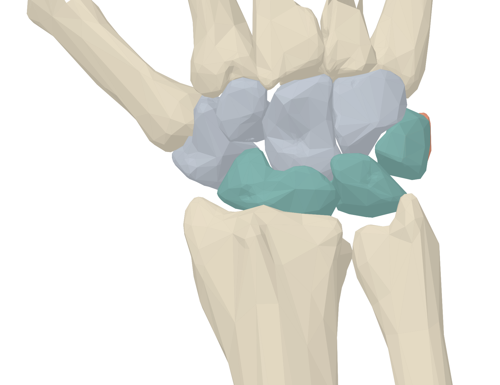
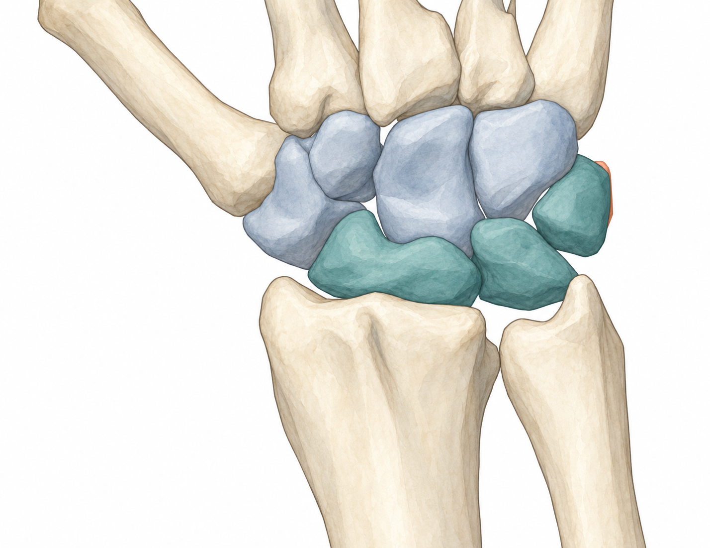
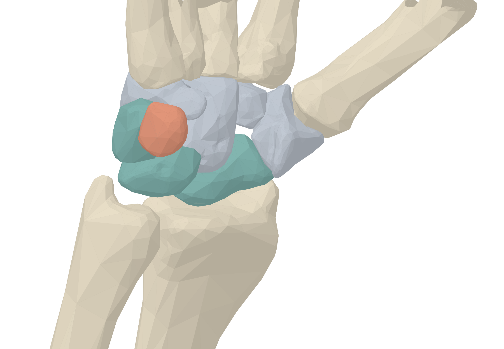
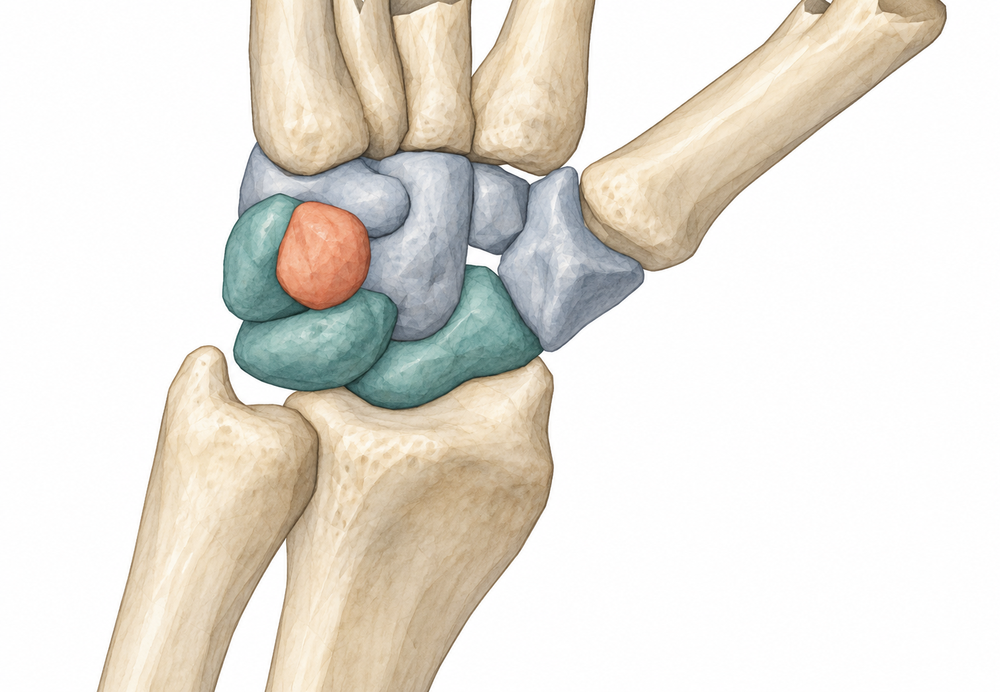
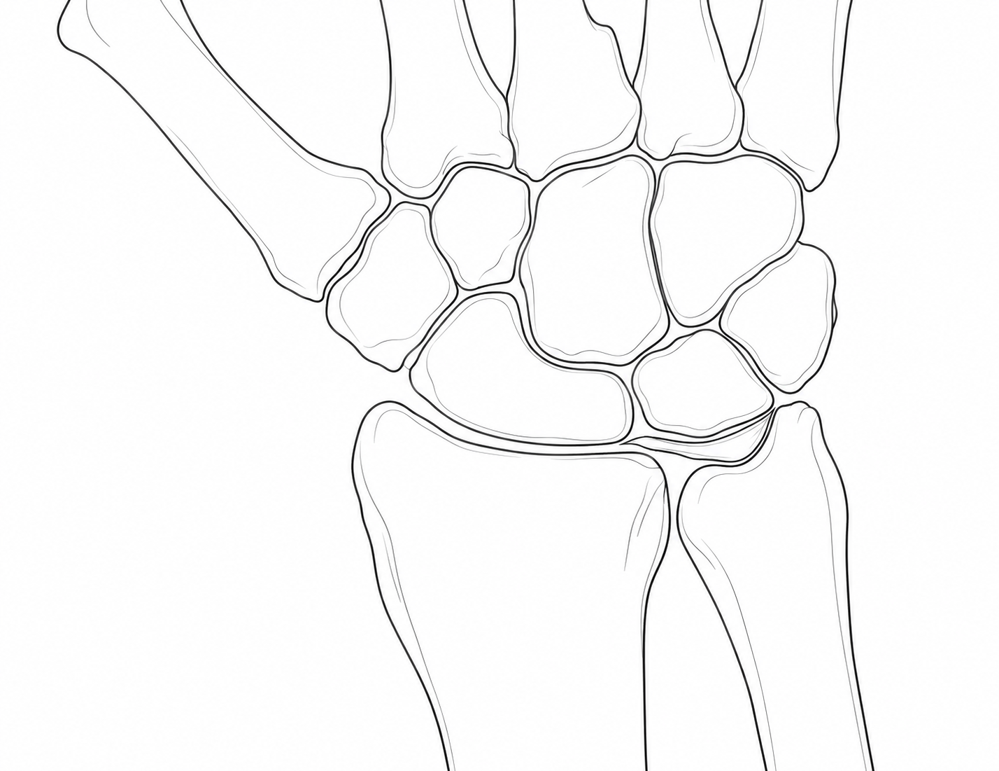
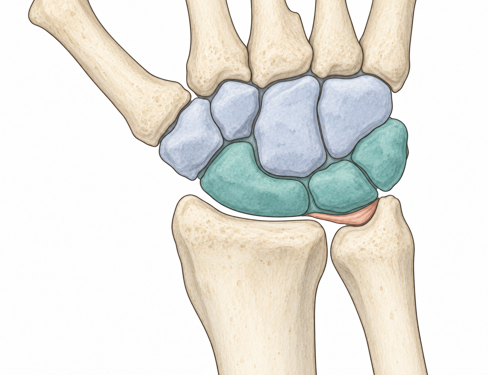

# 腕骨与关节组成 · 医生示例 v1.1

这份六页漫画由医生与阿旋讲解腕骨和关节，作为本 Skill 的解剖参考示例：5 幅解剖底图都可追溯到具体图谱、教材图页、几何底板和实际生成附件。下文逐图说明依据及其支持范围，并展示成图与参考的局部对照。中文对白、编号和引线保留可编辑排版。

[轻量预览](preview-light.pdf) · [完整PDF（30.05 MB）](review.pdf) · [逐幅解剖图与参考对应](#解剖结构如何对应真实参考) · [来源与许可](CREDITS.md) · [机器可读输入清单](reference-map.json) · [返回主页](../../../README.md)

| 第 1 页 · 从故事认识结构 | 第 3 页 · 更换观察角度 | 第 5 页 · 关节接口 |
|:---:|:---:|:---:|
|  |  |  |

其他页面：[第2页](pages/page-2.jpg) · [第4页](pages/page-4.jpg) · [第6页](pages/page-6.jpg)。

## 解剖结构如何对应真实参考

以下关系来自原解剖彩稿的**实际生成调用附件清单**，本次重新打开对应文件并核对。不是仅列书名的参考书目。M01–M04 是 BodyParts3D 右侧模型的投影视图；M06 是用于冠状关系定位的解释性线稿，不冒充原始解剖照片或真实切片。B01–B05 是参考约束下生成的医学彩稿，成页另加可编辑文字、编号、引线及骨干边缘渐变。

v1.1重做五处人物场景，保留第6页下半幅近景；**没有把既有解剖底图重新交给生成工具绘制**。第3页仅调整外部方向提示和转场文字；第6页的圆片与词卡是分组教具，不是解剖形态的证据。

| 成页与彩稿 | 实际几何底板 | 原生成时确实附入的独立解剖图片 | 对应的结构与使用边界 |
|---|---|---|---|
| 第1页，B01 全手掌面 | [M01 右手掌面全骨](scaffolds/M01.png) | [Gray219](references/gray219.jpg)；[教材52页 Fig.4.18](references/springer-p52.png) | 指骨、掌骨、腕骨及前臂骨的分区、数量和邻接。左右及相机由右侧模型确定；Gray219 的原图方向不直接照搬。Fig.4.18 只辅助核对腕部关系，不覆盖全手所有细节。 |
| 第2页，B02 腕骨掌面 | [M02 右腕掌面分组](scaffolds/M02.png) | [Gray219](references/gray219.jpg)；[教材52页 Fig.4.18](references/springer-p52.png) | 近远排、八腕骨邻接和豌豆骨的掌侧遮挡；色组与教学号由制作时另行组织。 |
| 第3页上，B03 腕骨背面 | [M03 右腕背面](scaffolds/M03.png) | [Gray220](references/gray220.jpg)；[教材52页 Fig.4.18](references/springer-p52.png) | 背面所见骨形与遮挡。Gray220 的站点文字存在掌背描述冲突，不能单凭网页文件描述定向；成图方向以模型和实际图像核对。 |
| 第3页下，B04 腕骨掌尺侧 | [M04 右腕掌尺侧](scaffolds/M04.png) | [教材52页 Fig.4.18](references/springer-p52.png)；[教材53页 Fig.4.19a](references/springer-p53.png) | 三角骨与豌豆骨的前后位置、尺侧关系。两张教材图属于同一来源；独立的几何来源是 BodyParts3D。140°是两个模型相机的观察视角差，不是患者动作幅度。 |
| 第4、5页，B05 冠状定位 | [M06 冠状定位线稿](scaffolds/M06.png) | [Gray336](references/gray336.png)；[教材53页 Fig.4.19a](references/springer-p53.png) | 桡骨、舟/月骨及尺侧关节盘的空间关系；第5页另用矢量线标记关节接口。同次附入的 [B02](artwork/B02.png) **只用于上色风格**，不算独立医学来源。 |

教材为 Khalilzadeh、Canella、Fayad 的 *Wrist and Hand*（2021），书页52/53对应本地章节 PDF 第12/13页。Fig.4.18 展示掌背侧腕韧带背景下的骨关系；Fig.4.19a 是尺侧软组织示意。原输入是完整书页，包含其他图像；本例相关的正常形态对应示意子图，不能把同页 MRI 或病变图片说成骨形生成母版。[章节与图注](https://www.ncbi.nlm.nih.gov/books/NBK570159/)。

### 看图核对，而不是只看图源名称

点击图片可以查看原文件。模型投影与生成彩稿按各自真实方向展示，没有为对照而镜像。下方图谱/书页保留原始方向。

| 部位 | 实际几何底板 | 生成彩稿 |
|---|:---:|:---:|
| B01 全手掌面 |  |  |
| B02 腕骨掌面 |  |  |
| B03 腕骨背面 |  |  |
| B04 掌尺侧 |  |  |
| B05 冠状定位 |  |  |

| Gray219 · 掌面关系 | Gray220 · 背面关系 | Gray336 · 冠状关系 |
|:---:|:---:|:---:|
|  |  |  |

| 教材52页 · Fig.4.18 | 教材53页 · Fig.4.19a |
|:---:|:---:|
|  |  |

BodyParts3D © DBCLS；Gray 图版为公有领域；教材图页 © The Author(s) 2021，CC BY 4.0。各资产原链接、版本、加工方式和许可边界见 [CREDITS](CREDITS.md)，这些第三方资产不适用仓库笼统的非商业许可。

## 结构局部对照

下列五组对照从实际底板、彩稿与原始参考制作，包含全图与**展示用局部裁切**，不是新增生成附件。原始附件保持原样，裁切范围见[裁切记录](comparisons/crop-map.json)。各图保留原观察方向，不为对齐而镜像；颜色分组和编号不是图谱原有内容。

### 全手骨骼：第1页

B01、M01和Gray219对应全手掌面骨骼分区；模型给出本例右手机位，Gray保留原方向。

### 两排腕骨：第2页

B02与M02可按同机位比较近远排；Gray219用于掌面邻接关系核对，其上下方向与彩稿不同。

### 腕骨背面：第3页

B03和M03对应背面观察；Fig.4.18a补充含韧带的背侧骨性关系。Gray220是原始生成的另一份附件，仍见上方来源表。

### 三角骨与豌豆骨：第3页

B04、M04显示掌尺侧遮挡；教材Fig.4.18b补充掌侧关系，包含韧带，不能把它说成裸骨轮廓的逐像素母版。

### 桡侧关节面与关节盘：第4–5页

B05对应M06解释性冠状线稿，Gray336支持冠状关节关系；原图近端在上、彩稿近端在下，未静默镜像。[五页对照PDF（18.18 MB）](comparisons/reference-details.pdf)。

### 第5页新增动作的真实参考

左格展示手腕弯曲，右格展示掌心翻转的姿态；人物为虚构角色，既有骨图未重绘。本轮生图实际附入两组独立真人动作图：[Delva等2020 Fig.1](references/motion-delva-fig1.jpg)与[Zhang等2024 Fig.1](references/motion-zhang-fig1.jpg)。仅用于动作方向和可见手形约束，不复制受试者身份或实验装置；新动作画面仍医学待审，来源与许可见[CREDITS](CREDITS.md)。

## 检查与交付状态

- 人物与叙事：阿旋保留，用户明确她不属于需要排除的私有资产；医生比例和桌边环境统一，第5页增加动作对比，第6页明确指认两排之间。原豹形角色与内部旧场景输入不收入公开示例。
- 解剖保护：五幅解剖图、六次放置的解码图像内容及位置保持不变。第2–4页外部文字/方向提示有调整；不再声称第3页整页或所有医学区域逐像素一致。见[新版核验](preservation-check.json)。
- 编辑：原生AI有88个文字对象，其中13个区域文本框（11段对白、首页标题及一处两行医学说明）。人物场景与解剖底图分层，底图锁定。原生文件已重开检查，全部区域文本完整可见，0外链图片；AI在项目内单独交付。
- 阅读：高质量PDF保留矢量文字；轻量预览PDF保留完整六页故事及矢量文字，仅压缩图片，约0.20 MB；它是阅读副本，不是编辑源文件。逐页图片与PDF均为v1.1。
- 审核与发布：制作/编辑检查完成，医学待审；本地准备不代表已推送或创建Release。
