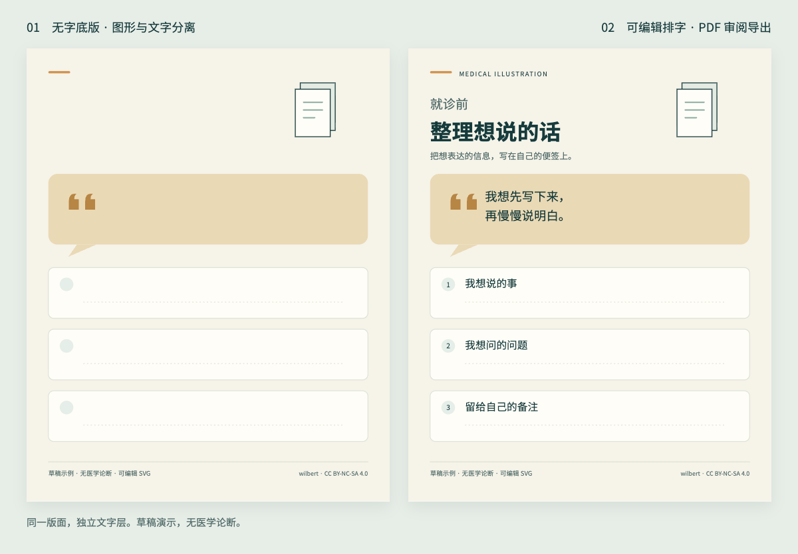

# 可编辑排字示例：就诊前信息整理

本示例展示无字底版、可编辑文字和 PDF 导出。它是无医学论断的 L 级版面草稿，无解剖图、诊疗建议、真实人物或患者资料，不代表医学作品审核通过。



## 输入与输出

- [input.md](input.md)：页面目标、锁定文案、分层和画布规格。
- [base.svg](base.svg)：保留审校页脚的无正文底版，版面与气泡为矢量对象。
- [lettered.svg](lettered.svg)：在相同版面上添加原生 SVG text 对象；正文、气泡和审校信息可分别编辑。
- [review.pdf](review.pdf)：单页数字审阅副本，800 × 1000 CSS px 对应 600 × 750 pt；不声称 PDF/X 或 Illustrator 原生 .ai。
- [preview.png](preview.png)：首页预览。

## 2026-09-07 检查记录

本轮在 macOS、Chrome 152 上生成并查看 PNG 与实际 PDF 渲染：

- 无字版与排字版的 background、artwork、review 组保持一致；只增加 lettering 组内容。
- SVG 保留原生可编辑文字，没有用栅格图替代正文；这不代表所有矢量软件导入后都自动保持相同排版。
- 文字边界处于画布内，气泡对白与边缘留有余量；检查了实际预览中的换行、缺字和遮挡。
- PDF 为 1 页，提取文字与文案相符；字体已嵌入，另检查了 PDF 渲染结果。
- 不含医学论断，证据/解剖母版/临床与解剖审核不适用。人工编辑批准未签署，状态保留草稿。

完整人体/解剖制图、图像模型调用、Illustrator 原生 .ai 导入与回存，不属于本示例验证范围。

## 复现与编辑

用支持 SVG text 的矢量编辑器打开 lettered.svg；按分组选择正文或气泡。字体缺失时先安装官方思源黑体，或选择实际覆盖中文的字体，再检查版面。

仓库维护者可在安装 Node.js、Playwright 和 Chromium 后，从仓库根执行：

```bash
node scripts/render_example.cjs
```

如需使用已有 Chromium/Chrome，可通过 `PLAYWRIGHT_CHROMIUM_EXECUTABLE` 指定可执行文件。渲染工具是维护示例用的可选依赖，安装 Skill 不需要它。仅有独立 Skill ZIP 的使用者可以直接打开源文件，无需仓库渲染脚本。

## 来源与许可

版面、文字和 SVG 是为此公开示例新建的内容，未使用原医学漫画项目的角色、底图或医学资产；作者 wilbert，内容采用 CC BY-NC-SA 4.0。

SVG 使用 `Source Han Sans CN`（思源黑体）及中文后备字体声明。PDF 中嵌入的思源黑体字体子集保留其 SIL OFL 1.1 许可；许可证原文随 [FONT-LICENSE.txt](FONT-LICENSE.txt) 提供。[Adobe 官方来源](https://github.com/adobe-fonts/source-han-sans/blob/release/LICENSE.txt)。独立字体文件不包含在安装包中。
